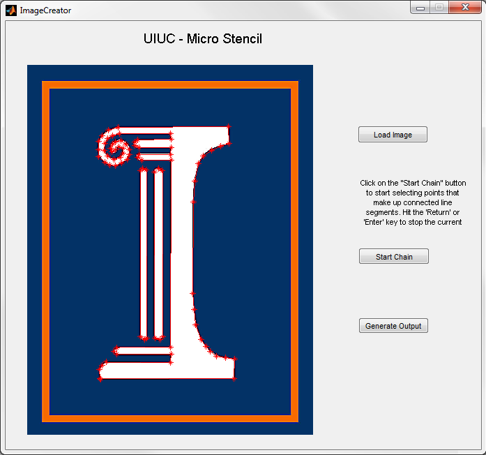
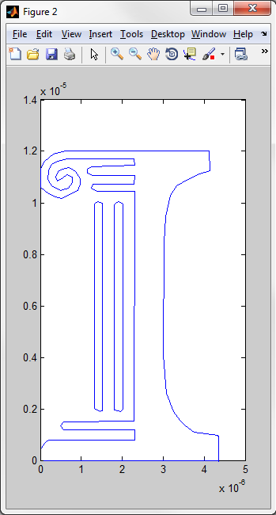
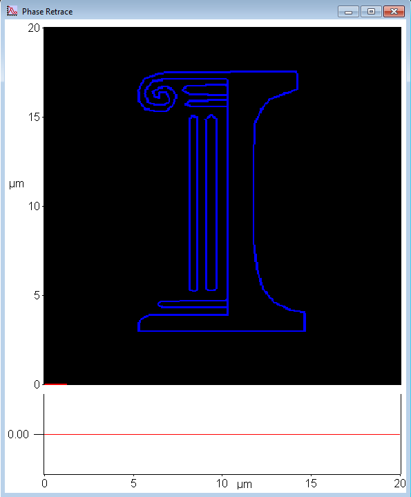

Micro-stencil
=============

**Suhas Somnath**

University of Illinois Urbana-Champaign

Last Updated: 2/13/2011

Introduction
--------------

Asylum Research provides a “bitmap” tool that reads a user specified
image file and generates sets of patterns that mimic the original image.
It becomes the user’s responsibility to remove any unwanted features
from the images such as the background, etc. as the software package is
not able to differentiate such features for the user. This Micro
Stencil package complements the `Smart Litho package <https://github.com/ssomnath/smart_litho>`_ by providing the
user the ability to conveniently generate a customized line-image and
import it into ``Igor PRO`` using ``Smart Litho``.

Journal papers that used this software
~~~~~~~~~~~~~~~~~~~~~~~~~~~~~~~~~~~~~~
* Somnath, Suhas, Hoe Joon Kim, Huan Hu, and William P. King. "Parallel nanoimaging and nanolithography using a heated microcantilever array." Nanotechnology 25, no. 1 (2013): 014001.

Installing & starting Micro-stencil
-------------------------------------

Requirements
~~~~~~~~~~~~
* Matlab 2010 or newer
* Matlab ``Image Processing`` toolkit

Once the current directory in Matlab is directed towards the folder
containing the two MicroStencil files, MicroStencil can be executed by
typing ``MicroStencil`` in the command prompt. 

Using Micro-Stencil
----------------------

Once the suite is started up, the Micro-Stencil window is presented and
following steps are followed to generate the custom line image:

1. The background image that is to be used as a guide or a stencil is
   loaded by clicking on the ``Load Image`` button.

2. Once the ``Start Chain`` button is clicked, the user clicks on points
   in the image to create a chain of connected line segments between
   these points as shown in Fig. 1 a. On hitting the return or ``Enter``
   key on the keyboard, the user can complete the current series of
   connected line segments. At this point, red stars connected via line
   segments are presented delineating the completed chain of line
   segments

3. Step 2 is repeated if required to make other connected segments.

4. Once the desired line image is formed, the user may click on the
   ``Generate Output`` button to generate a preview of the formed
   line-image as shown in Fig. 1 b. A separate window is also presented
   to save the acquired data to a \*.txt file.

5. The ``Load from Disk`` option is used in the ``UIUC Smart Litho``
   software to load this pattern into ``Igor Pro`` as shown in Fig 1 c.

**Fig. 1:** Complete cycle of events that show the interaction between
Smart Litho and Micro Stencil.

**(a)**: Image loaded to file and points manually specified

|image0| 

**(b)**: Line image created in Matlab

|image1| 

**(c)**: Line image imported into IGOR Pro via ``Smart Litho``.

|image2| 

**(d)**: The University of Illinois logo written in poly methyl
methacrylate on a ZnSe substrate at 120\ :sup:`o`\ C via Thermal Dip Pen Nanolithography (tDPN). 
Lithography performed by `Prof. Jonathan R. Felts <https://engineering.tamu.edu/mechanical/people/felts-jonathan.html>`_

|image3|

.. |image3| image:: media/step_4.png
   :width: 6.68333in
   :height: 7.39375in
